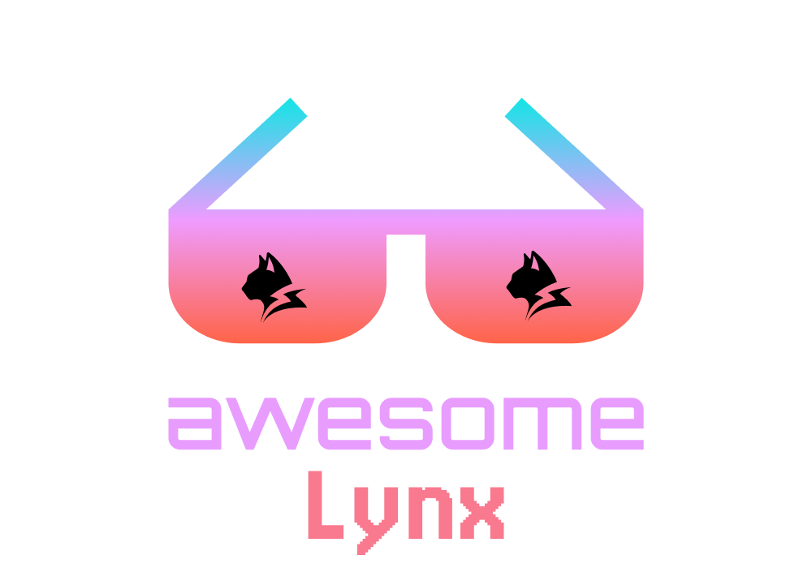

# Awesome Lynx 
> A curated list of awesome lynx ecosystem

## Contents

- [Lynx Family](#lynx-family)

## Lynx Family

- [Lynx](https://lynxjs.org) - Empower the web community and invite more to build across platforms.
- [PrimJS](https://github.com/lynx-family/primjs) - PrimJS is a lightweight, high-performance JavaScript engine designed specifically for the Lynx cross-platform framework.
- [React Lynx](https://lynxjs.org/react) - [**ReactLynx**](https://lynxjs.org/react/) is a framework that allows you to build cross-platform [**Lynx**](https://lynxjs.org/) apps with [**React**](https://react.dev/) paradigm.
- [Rspeedy](https://lynxjs.org/rspeedy) - The Rspack-based build tool for Lynx.
- [Lynx devtool](https://github.com/lynx-family/lynx-devtool) - An Electron-based developer tool for Lynx, providing mobile debugging features.
- [Lynx Web](https://github.com/lynx-family/lynx-stack/tree/main/packages/web-platform) - The Lynx's Web Platform is an implementation for Lynx's native binding APIs based on Browser APIs. 

Contributions welcome! Read the [contribution guidelines](contributing.md) first.
